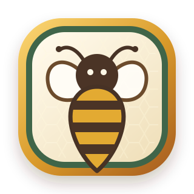
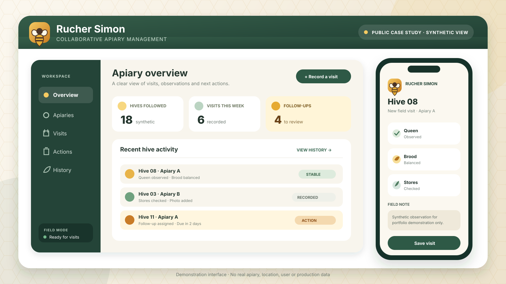
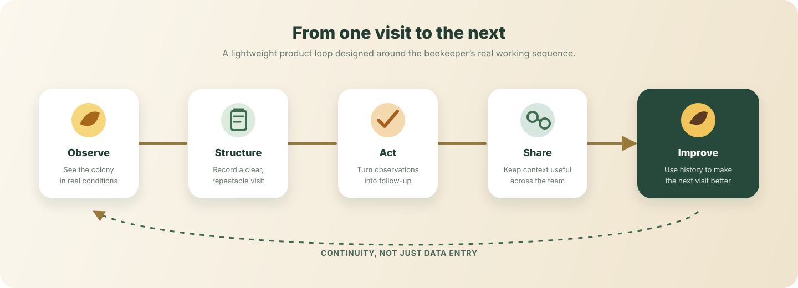

# Rucher Simon

### Collaborative apiary management, designed around real hive visits

*Keeping observations useful from one visit to the next.*

<em>Purpose-built demonstration interface with synthetic data — no production screen, apiary or user information.</em>

## Overview

Rucher Simon is a collaborative web application created to make apiary visits easier to record, understand and continue over time.

Beekeeping produces valuable observations in the field: colony condition, queen status, brood, stores, treatments, movements and the next action to remember. When that context is scattered across notebooks, messages or individual memory, continuity becomes difficult. Rucher Simon brings it into one shared, structured workflow that remains practical on both mobile and desktop.

This repository presents the **product journey and the skills demonstrated**. It is not the application’s source-code repository.

## The challenge

A useful field tool had to do more than store notes. It needed to:

- remain quick to use beside the hives;
- preserve the history of each colony;
- support several apiaries without losing context;
- make follow-up actions visible at the right time;
- allow collaborators to share useful information while keeping access scoped;
- work across devices without depending on one person’s notebook or memory.

## My role

I shaped the project from a practical beekeeping need into a working product.

My contribution includes:

- observing the visit sequence and identifying recurring information;
- translating field practice into structured product requirements;
- designing the information hierarchy and mobile-first workflows;
- prioritising the features that protect continuity between visits;
- coordinating implementation with AI assistance;
- testing the application in real conditions and iterating from feedback;
- keeping the public presentation useful without exposing private product details.

This work combines **field discovery, product ownership, workflow design and AI-assisted delivery**.

## Selected product capabilities

The public description is intentionally high-level. Rucher Simon supports:

- multiple apiaries and hive histories;
- structured visit records;
- queen, brood and stores observations;
- treatment and parasite follow-up;
- actions, reminders and visit continuity;
- photos and contextual notes;
- colony and frame movement records;
- collaborative use with scoped access.

## Product loop

The core design principle is simple: a record is valuable only when it helps the next decision.

<em>Public product view — not a representation of the application’s architecture or internal data model.</em>

## Outcome

Rucher Simon progressed from an identified field problem to an application used during real apiary work.

Its value is mainly practical:

- clearer history for each hive;
- better continuity between visits;
- fewer observations lost in separate notes or messages;
- shared visibility of actions still to complete;
- a workflow shaped by the people who actually use it;
- faster improvement when field feedback reveals a better approach.

## AI-assisted development

I use **ChatGPT and Codex** across functional decomposition, interface design, implementation, debugging, testing and documentation.

AI accelerates the build process. The field context, priorities, acceptance criteria, validation and product decisions remain human-led.

## Confidentiality and public scope

> **This is a deliberately non-technical public case study.**

This repository contains no:

- application source code, configuration or credentials;
- internal architecture, API details or security settings;
- real apiary names, locations or hive identifiers;
- personal information or collaborator accounts;
- production data, live screenshots or private documents;
- operational details that would expose the application’s implementation.

The source code, production environment and real field data remain private. Every interface shown here was created specifically for this portfolio with fictional content.

## What this project demonstrates

- field discovery and requirements analysis;
- domain-to-product translation;
- mobile-first workflow design;
- collaborative and role-aware product thinking;
- iterative delivery and real-condition testing;
- AI-assisted software development;
- product adoption and continuous improvement;
- responsible handling of private field data.

---

[Back to Thomas Simon’s GitHub profile](https://github.com/thomas26560)
